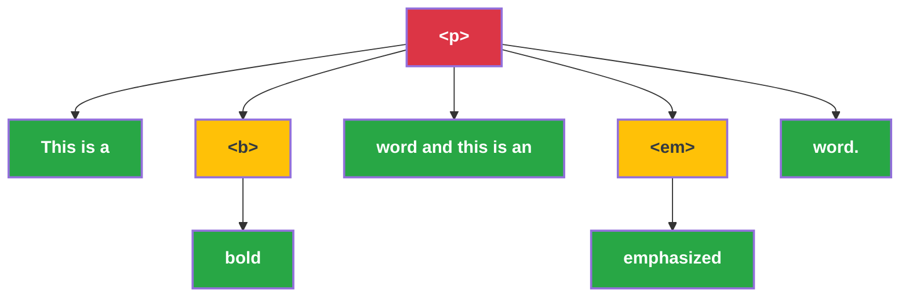

# HTML Conversion

- Terminal text nodes are to be converted to rich text blocks.
- Order of children blocks must be preserved
- Any node in the syntax tree can generate 3 types of objects: string, rich text, or block.
- Consequently, any node can receive a list of these objects as as children. Each of these must be handled properly: merge rich texts, append rich text to current block, if they can't be appended in the current node, pass them to the parent node while preserving the order of the children, and so on.

Below is an example paragraph element with child elements:

```html
<p>This is a <b>bold</b> word and this is an <em>emphasized</em> word.</p>
```

This yields the following syntax tree:



In this example, only the `<p>` element creates a JSON-DOC (paragraph) block.

- Terminal string nodes (colored green) are returned as strings while recursing the tree.
- HTML tags that don't create blocks (colored yellow), but apply some style, such as `<b>` and `<em>`, are returned as empty rich text objects with corresponding `Annotations`.
- HTML tags that create blocks (colored red), such as `<p>`, `<blockquote>`, `<code>`, etc. are returned as empty JSON-DOC blocks.

The function `process_tag(node)` receives the top level node and recurses its children which are themselves either HTML elements or text nodes.

```python
def process_tag(node):
    children_objects = []
    for child in node.children:
        if isinstance(child, NavigableString):
            children_objects.append(child.text)
        else:
            # Note that process_tag returns a list of objects and it is
            # concatenated to the children_objects list.
            children_objects.extend(process_tag(child))

    # Get the empty object corresponding to the current node (rich text, block or None)
    current_node_object: BlockBase | RichTextBase | None = convert_current_node(node)

    # Reconcile the children objects with the current node object
    return_objects: list = reconcile_children(current_node_object, children_objects)
    return return_objects
```

## Placeholder blocks

Some HTML elements are not guaranteed to be converted to a JSON-DOC block:

- For example, in JSON-DOC, images can have captions, but tables cannot. So HTML `<caption>` elements needs to be handled separately.
- HTML `<br>` elements do not resolve to a JSON-DOC block, but instead trigger a split in a parent block which can contain rich text.

To conditionally handle these elements, we create a corresponding placeholder block and handle them in various ways while the tree is being processed.

## Using the converter script

The Python package `jsondoc` includes a command line script `convert_jsondoc` to convert between JSON-DOC and other formats. To see how to use the converter script, run:

```bash
convert_jsondoc --help
```

Source and target formats can be specified with the `-s` and `-t` flags. If they are not specified, the converter will try to infer them from file extensions in input and output file names.

Convert the example HTML file to JSON-DOC:

```bash
convert_jsondoc -i examples/html/html_all_elements.html --indent 2
```

- The script will exclusively convert from JSON-DOC to other formats and vice versa. So either the source or the target must be JSON-DOC.
- If the source is not JSON-DOC, then target will be assumed to be JSON-DOC.
- If the source is JSON-DOC, then the target format will have to be specified, either directly with `-t` or indirectly by providing a file name with an extension that can be used to infer the format.

```bash
# Will convert an_awesome_file.docx to JSON-DOC and save it in awesome_jsondoc.json
convert_jsondoc -i an_awesome_file.docx --indent 2 -o awesome_jsondoc.json
```

You can also pipe the output of one converter to the input of another, to convert from one format to another.

```bash
# Convert from HTML to JSON-DOC and then to Markdown
convert_jsondoc -i an_awesome_file.html --indent 2 | convert_jsondoc -s jsondoc -t markdown
```

## Remaining tasks

- [x] Convert lists `<ul>` and `<ol>`
- [x] Convert line breaks `<br>`
- [x] Convert `<caption>` and `<figcaption>`
- [x] Force_page=true
- [ ] Residual strings, newlines or empty paragraphs in the final output list (in progress)
- [ ] Make sure `<a>` conversion is consistent
- [ ] Cleanup empty blocks at the end
- [ ] Table cells with colspan/rowspan
- [ ] Add test for `<code>` and `<pre>`
- [ ] Table thead/tbody/tfoot ordering
- [ ] Add sup/sub annotation?
- [ ] Add converters to/from other formats (markdown, latex, etc.)