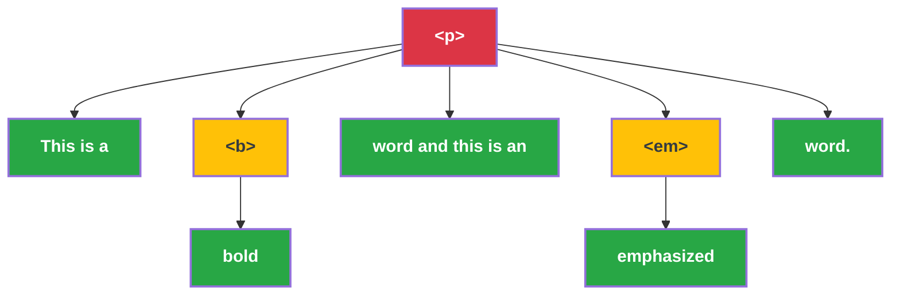

# HTML Conversion

- Terminal text nodes are to be converted to rich text blocks.
- Order of children blocks must be preserved
- Any node in the syntax tree can generate 3 types of objects: string, rich text, or block.
- Consequently, any node can receive a list of these objects as as children. Each of these must be handled properly: merge rich texts, append rich text to current block, if they can't be appended in the current node, pass them to the parent node while preserving the order of the children, and so on.

Below is an example paragraph element with child elements:

```html
<p>This is a <b>bold</b> word and this is an <em>emphasized</em> word.</p>
```

This yields the following syntax tree:



In this example, only the `<p>` element creates a JSON-DOC (paragraph) block.

- Terminal string nodes (colored green) are returned as strings while recursing the tree.
- HTML tags that don't create blocks (colored yellow), but apply some style, such as `<b>` and `<em>`, are returned as empty rich text objects with corresponding `Annotations`.
- HTML tags that create blocks (colored red), such as `<p>`, `<blockquote>`, `<code>`, etc. are returned as empty JSON-DOC blocks.

The function `process_tag(node)` receives the top level node and recurses its children which are themselves either HTML elements or text nodes.

```python
def process_tag(node):
    children_objects = []
    for child in node.children:
        if isinstance(child, NavigableString):
            children_objects.append(child.text)
        else:
            # Note that process_tag returns a list of objects and it is
            # concatenated to the children_objects list.
            children_objects.extend(process_tag(child))

    # Get the empty object corresponding to the current node (rich text, block or None)
    current_node_object: BlockBase | RichTextBase | None = convert_current_node(node)

    # Reconcile the children objects with the current node object
    return_objects: list = reconcile_children(current_node_object, children_objects)
    return return_objects
```


## Remaining tasks

- [x] Convert lists `<ul>` and `<ol>`
- [x] Convert line breaks `<br>`
- [ ] Convert `<caption>` and `<figcaption>`
- [ ] Add sup/sub annotation?